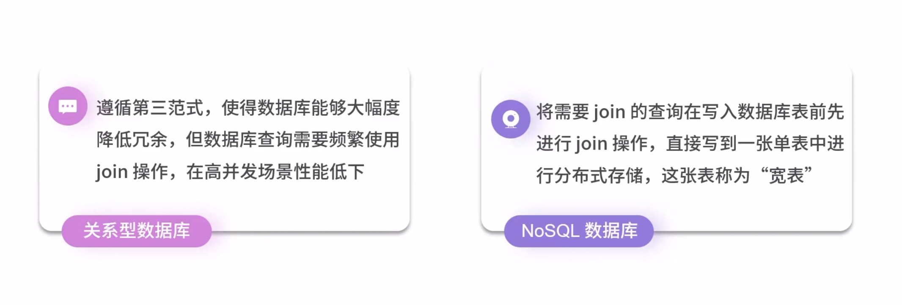
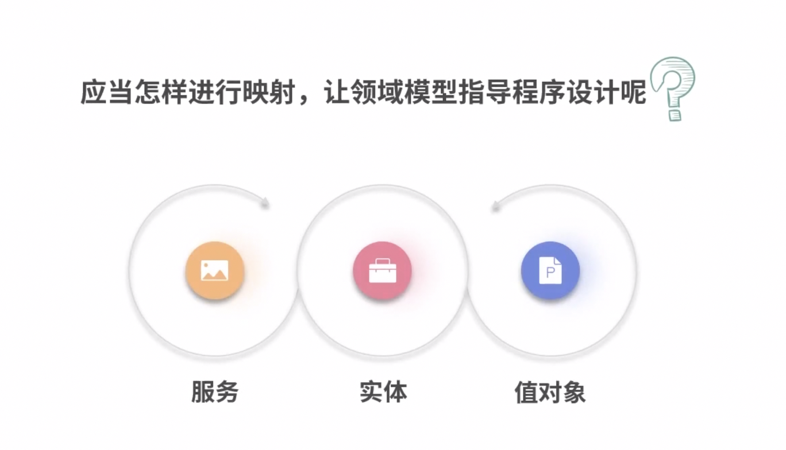

# 单一职责原则

软件系统中的每个元素只完成自己职责范围内的事，而将其他的事交给别人去做，我只是去调用

> 一个职责就是软件变化的一个原因
>
> -《敏捷软件开发：原则、模式与实践》

当用户提出一个需求变更时，为了实现这个变更而修改软件的成本越低，软件质量就越高。

因为变动软件还需要一系列的测试和联调。

将同一个原因变更的代码都放一块或一个类中（不同原因放在不同的模块或类中）

> 例如:
>
> 当“付款”发生变更时，“折扣”是不是一定要变更？
>
> 当“折扣”发生变更时，“付款”是不是一定要变更？
>
> 当“用户”发生变更时，“VIP会员”是不是一定要变更？
>
> 当“VIP会员”发生变更时，“用户”是不是一定要变更？

# 表设计

在继承关系时，如果子类较少，可以汇聚到一张表上。（由于字段汇集，所以可能出现表稀疏）

遵循第三范式能使得数据裤大幅降低冗余，但频繁使用Join操作，使得高并发场景下性能低下。

解决办法：

在NoSQL中，null并不占用空间，所以尽量在单表中存储更多字段，避免数据查询中的join操作

# 程序设计

service PO VO

服务：application，接收请求，执行相应方法，再将实体或值对象的数据持久化

实体：Entity，通过唯一标识区分真实世界的每一个个体的领域对象（思考实例和引用）

值对象：一成不变的，本质性的事物（生命周期内不变，用完就扔）

> 区分：可变性是实体的特点，不变性是值对象的本质

