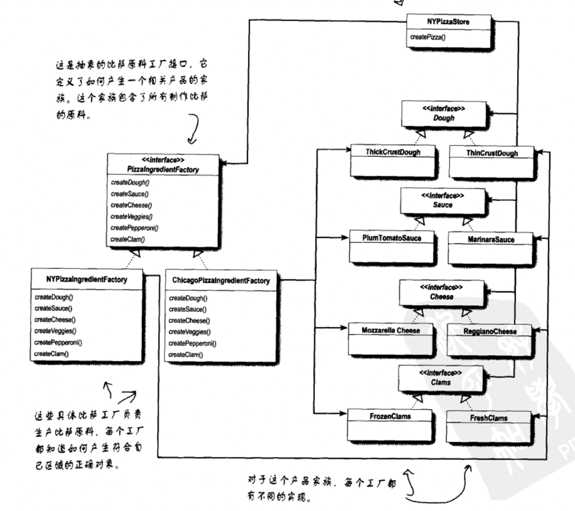
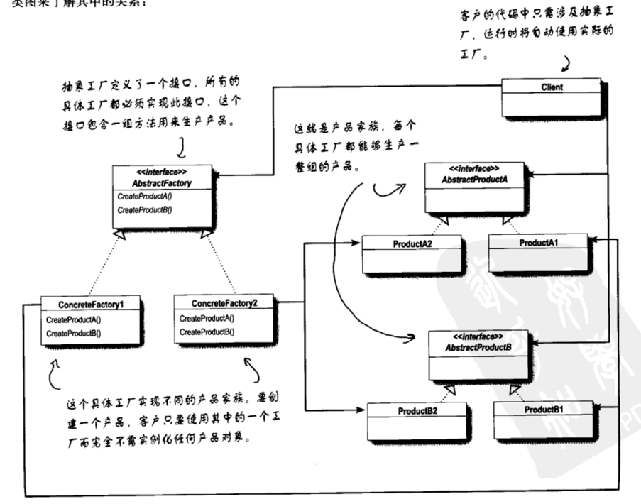

# 依赖倒置

高层级组件只依赖高层级组件，不能让高层级组件依赖低层级组件。“两者都应该依赖于抽象”

父抽象的创建由子类去实现，但实际组装还在父类方法，相当于子类依赖父类

本来高层级PizzaStore依赖低层级ChicagoStylePizza，但提出了一个抽象类Pizza，让高层级PizzaStore依赖高层级Pizza。

所以最后变为低层级ChicagoStylePizza依赖高层级Pizza

## 抽象工厂

抽象工厂的方法经常以工厂方法的方式实现

